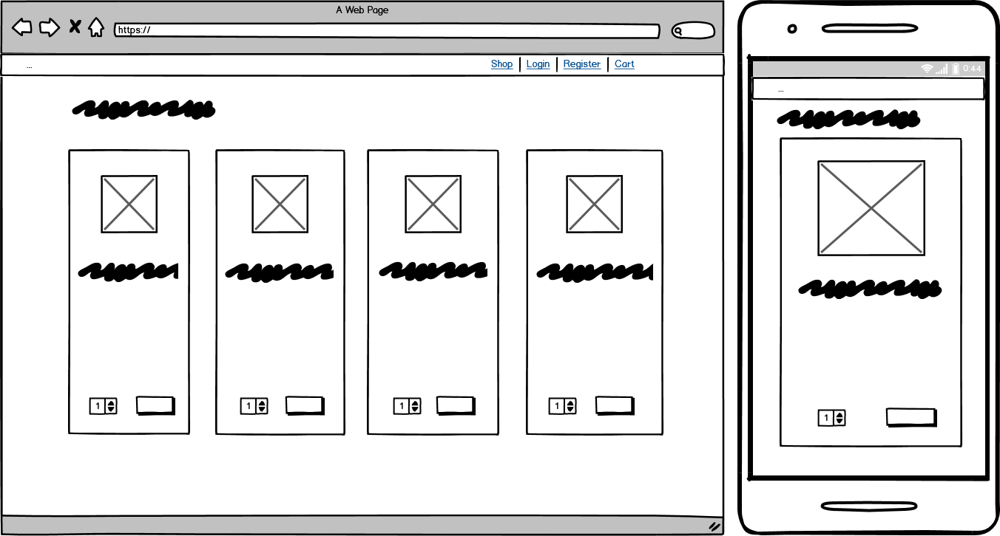
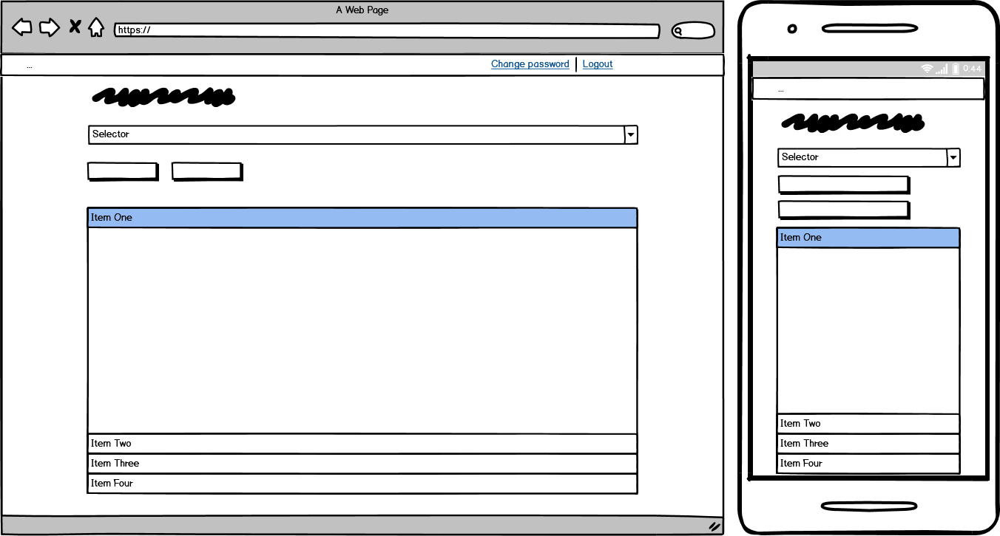
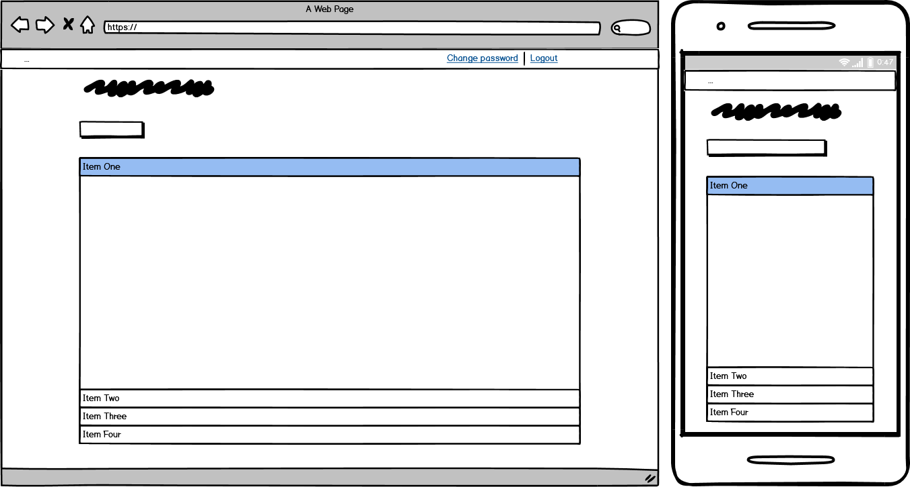
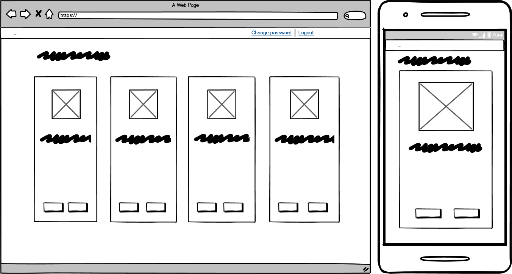

# Full-Stack Development Milestone Project

[](https://travis-ci.com/faithy80/fsd-project)

This is my final project at the Code Institute Full-Stack Web Developer course. The purpose of the project is to demonstrate the strength of the Django framework and its scalability. Also, the ease of use encourages anybody to learn full-stack web development.

The features of Django:

* Django has excellent documentation as it was developed by a newspaper at the beginning.
* Django uses Python Web-framework. Python is one of the easiest languages to learn. Its simplicity allows us to create, modify, and debug backend codes and frontend templates easily.
* Django is optimized for search engines. Django works with URLs rather than IP addresses. Easy to add them to search engines without the need for conversion.
* Django is highly scalable. Only the necessary features need to be implemented. It suits both small and large projects.
* Django is very versatile in its way. The logical structure (MVT, Model-View-Template) is a bit strict but it gives a stable fundamental for the developers.
* Django offers high-level security. The sensitive information remains hidden at all times. Also, the csrf security tokens allow the users to pass information to the backend in a secure way.
* Django provides an automated testing environment. Writing unit tests makes debugging easier and helps to understand defensive programming. The tests are useful at creating error-proof applications as the code can be tested thoroughly.
* Django provides rapid development. The framework already has a lot of built-in features. Also, external applications can be added to the project from [pypi.org](https://pypi.org/) to speed-up the development.

My project was inspired by the Covid-19 crisis. My children handed in their homework in digital format and were communicating with their teachers via an android application called seesaw during the pandemic. This project is an application for local schools. It is not only for communication but for buying certain products/services from the school. Although it is developed for local schools, it can be scaled to county-sized or country-sized use.

## Table of contents

* [Demo](#demo)
* [User stories](#user-stories)
* [UX](#ux)
  * [Strategy plane](#strategy-plane)
  * [Scope plane](#scope-plane)
  * [Structure plane](#structure-plane)
  * [Skeleton plane](#skeleton-plane)
  * [Surface plane](#surface-plane)
* [Wireframes](#wireframes)
* [Features](#features)
* [Future implementations](#future-implementations)
* [Technologies](#technologies)
  * [Languages](#languages)
  * [Libraries and frameworks](#libraries-and-frameworks)
  * [Hosting, deployment, and testing](#hosting-deployment-and-testing)
* [Deployment](#deployment)
  * [Local deployment](#local-deployment)
  * [Heroku deployment](#heroku-deployment)
* [Testing and validation](#testing-and-validation)
* [Credits](#credits)
  * [Content](#content)
  * [Acknowledgements](#acknowledgements)

## Demo

The live demo is hosted by Heroku. Click [here](http://fsd-project.herokuapp.com/) to open the web application.

The following accounts are available for testing:

* admin
* teacher1
* student1
* student11
* student111

The password is Password2020 for every account.

## User stories

The following user stories were considered:

* As a parent, I want to browse the shop, so I can view the products.
  * Acceptance criteria: build a shop view

* As a parent, I want to add the products to the cart, so I can buy them.
  * Acceptance criteria: build a cart to add the products to

* As a parent, I want to pay online for the products, so I shop conveniently.
  * Acceptance criteria: build a checkout view to fill out the form and the card details for the online purchase

* As a parent, I want to get a confirmation email, so I can have proof of the purchase.
  * Acceptance criteria: send a confirmation email from the checkout view that contains at least the order number as a reference

* As a student, I want to register an account, so I can log in to the website.
* As a teacher, I want to register an account, so I can log in to the website.
* As a student, I want to reset my password, so I can log in to the account in case if I forget the old password.
* As a teacher, I want to reset my password, so I can log in to the account in case if I forget the old password.
* As a student, I want to change my password, so I can keep my credentials more secure.
* As a teacher, I want to change my password, so I can keep my credentials more secure.
  * Acceptance criteria: build a custom authentication system based on the Django's built-in authentication system

* As a student, I want to upload my homework, so my teacher can review it.
* As a student, I want to remove my homework, so I can rework or correct it.
* As a student, I want to send and receive messages, so I can keep in touch with my teacher.
* As a teacher, I want to upload content, so my students can have extra help for their homework.
* As a teacher, I want to remove content, so I can change it if an incorrect one was uploaded.
* As a teacher, I want to send and receive messages, so I can keep in touch with my students.
  * Acceptance criteria: build a separate dashboard for the teachers and the students, and add the desired features to it

* As an admin, I want to have access to all data in the database, so I can track the database usage.
  * Acceptance criteria: add a link to the built-in Django admin dashboard from the custom admin dashboard and add every model to it

* As an admin, I want to add a product, so the shop can have more products to sell.
* As an admin, I want to edit a product, so I can change the product features or correct any mistakes.
* As an admin, I want to view products, so I can see what is in the shop already.
* As an admin, I want to delete a product, so I can remove the unnecessary products.
  * Acceptance criteria: build the corresponding views to cover the operations

* As an admin, I want to view the orders and the items conveniently, so I can gather the items and give the parents.
  * Acceptance criteria: build an order list view to check the orders conveniently

## UX

### Strategy plane

> What am I aiming to achieve in the first place, and for whom?

The project is for the teachers, the pupils, and their parents. It has three main parts.

The first one is the communication between the teachers and their pupils. Both the teachers and the students can upload content, send, and receive messages.

The second main part is the shop application. The parents can pay for book rental, art & craft, stationery, etc. It is also useful to pay for the school tour or summer camps. The shop accepts convenient and secure card payments using Stripe and sends a confirmation email on successful payment.

The third main part is the admin dashboard. The products/services can be added to the shop on that page. The orders and the items are easy to track in the admin dashboard too.

The registration is fully automated and there is a password recovery option via email. While the students and the teachers have an account to log into, the parents don't have an account. Also, the admin is responsible for tracking the orders and managing the shop in this project. It is a plan to create an account for the parents to order more conveniently and for the school secretary to maintain the shop and the orders.

### Scope plane

> What features do I want to include in my design?

The following features were implemented:

* teachers can log in to the teacher dashboard
* teachers can view the uploaded content by their students (only one student account at a time)
* teachers can upload content for their students (for all students in the class)
* teachers can send messages to their students (only the student who the message was sent to can see it)
* teachers can receive messages from their students
* teachers can only get in touch with the students in the same class (e.g. students in the junior infant class, if the teacher is teaching in the junior infant class)

* students can log in to the student dashboard
* students can upload their homework in digital format (e.g. pictures, documents, etc.)
* students can view the uploaded content by their teacher
* students can send messages to their teacher
* students can receive messages from their teacher

* parents can browse the school products/services and put the desired quantity in the shopping cart
* parents can change the quantity of the selected products/services in the shopping cart
* parents can remove the selected products/services from the shopping cart in case of necessity
* parents can fill out the order form and card details to buy the selected products/services

* admins can log into the admin account
* admins can view every model in the database in the Django built-in admin dashboard
* admins can add, edit or delete an entry in the database in the Django built-in admin dashboard
* admins can add, edit or delete a product/service
* admins can view the orders and the ordered items

* admins, teacher, and students can change or recover the password for their account in case of necessity

### Structure plane

> How is the information structured?

The landing page contains every information. The users can decide if they either want to shop, register for an account, or log in to an existing one. The backend redirects the authenticated users to the corresponding dashboard. The teacher dashboard looks very similar to the student one. The only difference is the extra page where the teachers can view the selected student's uploaded content and messages. The structure of the pages is very simple and straightforward. It is easy to find everything that the user may look for.

The structure of the database as follows:

* The User model is a built-in Django model for authentication.

* The Profile model from the dashboard application:
  * user = models.OneToOneField(...), the data from the user model
  * user_type = models.CharField(...), student or teacher
  * classname = models.CharField(...), name of the class (e.g. junior infant)

* The ContentUpload model in the dashbard application:
  * user = models.ForeignKey(...), the data from the user model
  * description = models.CharField(...), the description of the content
  * content = models.FileField(...), the file for uploading
  * upload_date = models.DateField(...), the date of the upload

* The Messages model in the dashboard application:
  * from_user = models.ForeignKey(...), the sender's data from the user model
  * to_user = models.ForeignKey(...), the receiver's data from the user model
  * message = models.CharField(...), the message itself
  * message_date = models.DateTimeField(...), the date and time of the message

* The Product model in the shop application:
  * product_name = models.CharField(...), the name of the product
  * product_description = models.CharField(...), the description ofthe product
  * product_price = models.DecimalField(...), the price of the product with 2 decimal places
  * product_image = models.ImageField(...), the picture of the product

* The Order model in the checkout application:
  * order_number = models.CharField(...)
  * full_name = models.CharField(...)
  * email = models.EmailField(...)
  * phone_number = models.CharField(...)
  * address1 = models.CharField(...)
  * address2 = models.CharField(...)
  * town_or_city = models.CharField(...)
  * county = models.CharField(...)
  * eircode = models.CharField(...)
  * order_date = models.DateTimeField(...)
  * order_total = models.DecimalField(...), the grand total of the order

* The OrderItem model in the checkout application:
  * order_reference = models.ForeignKey(...), the order number as a reference
  * product_name = models.CharField(...), actual product name
  * price = models.DecimalField(...), actual price of that product
  * quantity = models.IntegerField(...), the selected quantity of the product

### Skeleton plane

> How is the information implemented, and how will the user navigate through the features?

On the landing page, the navigation bar is responsible to guide the user in the right direction. The mobile view has a simple navigation bar that opens a sidebar on click. The shop, the login, the registration, and the cart view is only available when the user is not logged in. The change password and the logout navitems are only visible on the navigation bar after the successful authentication. The views in non-authenticated mode have buttons on the bottom of the page to go forward or go back in the process to fix something or simply start over. The dashboards are a small bit different again. There are buttons on the top of the page to select the task that the users wish to do on the website. Every view that opens from the dashboard has the buttons on the bottom of the page for navigation. The exception from this rule is the edit product view where also a red-coloured delete button can be found at the bottom of the page.

### Surface plane

> What will the product look like?

The mobile-first approach design was implemented on this website to maintain the user experience from mobile devices to desktop computers. The Materialize CSS framework is responsible for the responsiveness.

Each page is divided into three sections: the navbar, the actual page that contains the information, and the footer.

The footer remains hidden until the user scrolls down to the bottom of the page. It does not have much use in this project but it may display contact information, map, social site icons, and other useful information.

The navbar is simple. The colours are light but separated from each other. There is not much typography on the website yet. The default font was used for this reason. There is an accordion on the teacher and the student dashboards. Although it displays only one information at a time (teacher content, student content, or the messages), it is simple to use and it keeps the page tidy.

I chose Material CSS for the frontend design. I wanted to try another framework and I like the "materialized" input fields. Certainly, every design element, the framework, or the way of displaying the information can be changed to meet the customers' expectations.

## Wireframes

### Home page


### Shop page



### Teacher dashboard page



### Student dashboard page



### List products page



## Features

I already mentioned some of the visible features in the UX Scope plane section. There are also a few hidden ones. The backend is the heart of the project. It gathers all the information for the views and stores all the information that comes from the frontend. It is connected to a free Postgres database hosted by Heroku. The dj-database-url and the psycopg2-binary applications are connecting the database to the backend. The gunicorn application is responsible for running the Django website on the Heroku server. The static files and media content are hosted by the Google Cloud Storages API. I used the whitenoise app for static file hosting in debug mode but the project stopped working with an internal server error after switching to production. I have tried a lot of solutions to fix the problem but they did not work. The fastest and easiest way to get the project working again was to move the static file hosting to GCS too. The Stripe application ensures a smooth, secure, and convenient card payment. A short JavaScript code guarantees the real-time connection to [stripe.com](https://stripe.com/ie) for the enhanced user experience and the immediate card data validation.

## Future implementations

I am planning to implement the following features in the future:

* to create webhooks for Stripe to ensure that every order is stored in the database and every confirmation email is sent after a successful payment
* to add more unit tests for the dashboard view to cover more code
* to write more code for the backend to strengthen the defensive design
* to add a short JavaScript code to refresh the page after the session expires
* to create a profile option for parents
* to create a separate account for managing the shop and the orders
* pagination

## Technologies

### Languages

Required technologies:

* HTML 5
* CSS 3
* JavaScript
* Python
* Django
* Relational database (MySQL or Postgres)
* Stripe payment
* Additional libraries and APIs

Technologies used in the project:

* HTML5
* CSS3
* JavaScript
* Python (3.6)
* Django 3
* Google Cloud Storage API
* Sendinblue email API

### Libraries and frameworks

* [Materialize CSS (1.0.0)](https://materializecss.com/) framework for developing responsive websites
* [jQuery (3.5.1)](https://jquery.com/) library to use JavaScript easier on the website
* [django-materializecss-form](https://pypi.org/project/django-materializecss-form/) Materialize CSS style for Django forms
* [django-storages](https://pypi.org/project/django-storages/) static and media file hosting by Google Cloud Storage API
* [dj-database-url](https://pypi.org/project/dj-database-url/) to use database URL in Django applications
* [Pillow](https://pypi.org/project/Pillow/) for Python Imaging Library
* [stripe](https://pypi.org/project/stripe/) to handle secure card payments
* [coverage](https://pypi.org/project/coverage/) code coverage measurement for Python
* [gunicorn](https://pypi.org/project/gunicorn/) WSGI HTTP Server for UNIX
* [psycopg2-binary](https://pypi.org/project/psycopg2-binary/) Python-PostgreSQL Database Adapter
* [django-anymail](https://pypi.org/project/django-anymail/) Django email integration for several transactional email service providers

### Hosting, deployment, and testing

* [Git](https://git-scm.com/) for version control
* [Github](https://github.com/) for code hosting
* [Heroku](https://heroku.com) for app deployment and relational database hosting
* [Travis-CI](https://travis-ci.com/) for test deployment  

## Deployment

### Local deployment

The local deployment needs a development environment to run the Django application. I am using Windows Subsystem for Linux (WSL2) and Microsoft VCode, so I can keep the Windows operating system for the everyday use, and work with the Linux subsystem for developing at the same time. A virtual environment (venv, virtualenvwrapper, etc.) is also required to keep the pip3 installed applications separately. The most important developer tools (pip3, git, Heroku CLI, etc.) also need to be installed.

Before starting the deployment, we need to set up the Sendinblue email service provider, the Stripe account, and the Google Cloud Storage API. The Sendinblue and the Stripe registration are straightforward but the GCS is a bit hard to set for the first time. The steps are as follows:

* create a new Gmail account or use an existing one
* create a project in the [Google Developer Console](https://console.developers.google.com/).
* enable the Google Drive API
* create a service account key and download as a JSON file
* create a bucket for the file hosting

The following links may help to achieve the steps:

* [Creating a service account key](https://cloud.google.com/storage/docs/reference/libraries)
* [Creating a bucket](https://cloud.google.com/storage/docs/creating-buckets)

Once the environment is prepared, the web application can be installed using the following commands:

* clone the source code: `git clone https://github.com/faithy80/fsd-project.git`
* change directory: `cd fsd-project/`
* install requirements: `pip3 install -r requirements.txt`
* place the environmental variables in the env.py file. The env-sample.py file in the source code can be used as a guide. The application needs:
  * a SECRET_KEY
  * an EMAIL_API_KEY (v3) from Sendinblue
  * a DJANGO_EMAIL as a "from email" address
  * a DATABASE_URL for the Postgres database hosted by Heroku (optional in local development)
  * a STRIPE_PUBLIC_KEY and a STRIPE_SECRET_KEY from Stripe
* place the service account JSON file to the project directory and rename it to google-credentials.json

The application is set for the Postgres database in Heroku. To revert it to default, change the following code in the settings.py:

From:

```txt
DATABASES = {
    'default': dj_database_url.parse(os.environ.get('DATABASE_URL'))
}
```

To:

```txt
DATABASES = {
    'default': {
        'ENGINE': 'django.db.backends.sqlite3'
    }
}
```

After the change, the web application will use the local MySQL database that is created in the root of the project directory.

Then use the final commands to finish the deployment:

* migrate the database: `python3 manage.py makemigrations && python3 manage.py migrate`
* create an admin account: `python3 manage.py createsuperuser`
* collect static files: `python3 manage.py collectstatic --noinput`

To start the project:

* `python3 manage.py runserver`

### Heroku deployment

The Heroku deployment is as follows:

* create a project on Heroku
* Set the Config variables in the settings menu on the Heroku website (the environmental variables mentioned above)
* set DISABLE_COLLECTSTATIC to 1
* set GOOGLE_APPLICATION_CREDENTIALS to google-credentials.json
* copy the content of the google-credentials.json file and set it as the GOOGLE_CREDENTIALS key

The content will look like this:

```JSON
{
  "type": "service_account",
  "project_id": "",
  "private_key_id": "",
  "private_key": "",
  "client_email": "",
  "client_id": "",
  "auth_uri": "",
  "token_uri": "",
  "auth_provider_x509_cert_url": "",
  "client_x509_cert_url": ""
}
```

The deployment needs a buildpack to convert the GOOGLE_CREDENTIALS key to the google-credentials.json file and save it to the Heroku server. Download the buildpack from [here](https://github.com/buyersight/heroku-google-application-credentials-buildpack.git) and add it to the settings of the project on the Heroku website.

The next step is the code deployment. I prefer the automatic deployment from the Github. There is also an option to deploy the code from CLI. If the code deployment is finished without any error, the following commands will finalize the installation process:

* migrate the database: `heroku run python3 manage.py makemigrations -a <app_name> && heroku run python3 manage.py migrate -a <app_name>`
* create an admin account: `heroku run python3 manage.py createsuperuser -a <app_name>`
* collect static files: `heroku run python3 manage.py collectstatic --noinput -a <app_name>`

## Testing and validation

This project was both automated and manually tested. All the automated test results are 80% or above overall for each application.

The result are as follows:

* accounts app: 97%
* cart app: 94%
* checkout app: 88%
* dashboard: 80%
* home: 88%
* shop: 88%

As a part of the defensive design, some chunk of the code was unit tested against invalid data to prove that the code is error-proof. The frontend was also tested manually for the same reason. Both the frontend and the backend has an error handling mechanism in the code. In case if the defense of the frontend is bypassed, the backend can correct the data or get it corrected by the user.

The Github account of the project is connected to a TravisCI account to ensure the continuous integration test after each git push to the master branch. After all the tests passed, the website is deployed to the Heroku server.

The website was also tested manually thoroughly. The desktop and the mobile modes were both checked for any errors. The most annoying error that I could not fix is the connection reset by peer error (104). Unfortunately, the Google Cloud Storage API causes the problem and it happens rarely. The root cause comes from the free tier limited access.

Before switching to production, I was using the whitenoise application to host static files for my project. After the Heroku deployment and turning off the debug mode, the website stopped working and gave an internal server error (500) message. After a couple of hours of research, it turned out that the whitenoise app interferes with Heroku in the production. To fix this problem, I had to move the static file hosting to Google Cloud Storage too. I had to change the application that handled the communication between the GCS API and Django from django-googledrive-storage to django-storages.

The change generated another problem. If a file with an existing name on the server in the same directory was uploaded, the existing file was overwritten rather than uploaded with an alternative filename. The problem remained hidden until I deleted a product that used the same file. A file not found error (404) came up when I tried to remove another product with the missing image. To solve this problem, I used UUID similar to creating the order number to generate a unique filename for each file before the upload. This solution guarantees that each content or product image will have a unique name.

Sending emails was handled by the Django SMTP handler using a Gmail account at the beginning. I had to change it. The email sending service did not work at all. The real solution was to switch to an API. After a long time and a lot of email service providers, I found the django-anymail application and [Sendinblue](https://www.sendinblue.com/). Sendinblue is also a free tier API but it is fast enough, reliable, and easy to configure.

The manual tests were successful. Every page is rendered. The registration, the login, the password changing, and the password recovery processes also work fine. The content can be uploaded. All the sent messages and uploaded content appear in the dashboard for both the student and the teacher. The admin can add, view, edit, or remove products and has a convenient view to check the orders and the ordered items. The Stripe payment system was also tested by the provided test card numbers. The website sends automated confirmation and password recovery emails.

Every python file and template is validated. The rendered HTML code was tested rather than the template as the HTML validator is not able to test Jinja templates.

The following services were used for code validation:

* [W3 HTML Validation Service](https://validator.w3.org/#validate_by_input) for the HTML code,
* [W3 CSS Validation Service](https://jigsaw.w3.org/css-validator/validator.html.en) for the CSS code, and
* [PEP8 Online Checker](http://pep8online.com/) for the python code.

## Credits

### Content

The project was inspired by the android version of the [seesaw](https://web.seesaw.me/). Every image was downloaded from [unsplash.com](https://unsplash.com/). Google search was used to research the problems and I got most of the solutions from [stackoverflow.com](https://stackoverflow.com/).

### Acknowledgements

I'd like to thank

* Code Institute for the tutorials all the help I got to progress and finish the website, and
* Mentor Brian Macharia for his advice and guiding me through this project.
